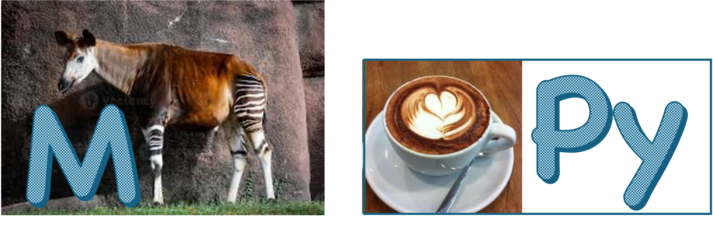

# MOCCaPy {.scrollable}



A Python front-end to MOCCa

## Python

:::: {.columns}

::: {.column width="40%"}
- is dynamic
- is interpreted 
- is easy to learn
- is easy to read
- portability
- well documented
:::

::: {.column width="60%"}
- is a general purpose programming language
- Python standard library 
- vast collection of HQ third party libraries, frameworks and tools
- Free, open, powerfull community 
:::

::::

All nice features

Minor problem: Python doesn't always play well with [distributed file systems](https://rcs.ucalgary.ca/How_to_work_with_large_number_of_small_files)

## Python {.scrollable}

 is a door to many worlds

:::: {.columns}

::: {.column width="50%"}
- Numpy
- SciPy
- Numba
- pyELPA
- pyScaLAPACK
:::

::: {.column width="50%"}
- JAX
- mpi4py
- hdf5py
- ...
:::

::::

## Python

- is also slow (because of the features we like so much: _interpreted_ and _dynamic_)

```{.python code-line-numbers="|1-2|3"}
    for i in range(m):
        for j in range(n):
            omg[i,j] = process(A[i,j]) # performance disaster
```

(anecdotical evidence)

- So, how comes Python modules like `numpy` are efficient after all?

## Python

- Performance critical Python modules (Numpy, SciPy, ...) have compiled C/C++/Fortran code under the hood: _binary extension modules_.
- They use a wrapper that handles the conversion between Python types and C/C++/Fortran types
- The C/C++/Fortran source code is highly optimized (BLAS, LAPACK)

## Python binary extension modules

Manual approach:

```{mermaid}
graph LR
    A("Python script") <--> B("ctypes wrapper")
    B <--> C(.so)
```

- The `.so` file is a dynamic library (_shared object_), compiled from C, C++, Fortran, ...
- The wrapper is Python code, using `ctypes` (part of the the Python Standard Library). The wrapper and `.so` are separate files
- (E.g. pyScaLAPACK)

## Python binary extension modules

Tooled approach:

```{mermaid}
graph LR
    A("Python script") <--> B("`.so with compiled code 
    and built-in wrapper`")
```

- `.so` behaves as an ordinary Python module 
- `numpy.f2py`: Fortran -> Python `.so` module
- `pybind11`, `nanobind`: C++ -> Python `.so` module
- support for numpy arrays! 

## MOCCa => MOCCaPy 

#### the simple approach

- remove the main program 
- compile all subprograms into `MOCCa.so` and use `ctypes` (the pyScaLAPACK approach)
- or use `numpy.f2py` to compile all subprograms into a python binary extension module `moccapy.so` 
- call the subprograms from a Python script that replaces the main program

## 

Relatively simple, but some disadvantages:

- limited flexibility
- maintaining and extending MOCCa remains hard
- source code remains highly coupled
- no object orientation, or superficial at best
- memory management is entirely done inside the `.so`
- need to write interface between Python and MOCCa data
- leveraging highly optimized Python libraries is hard (numpy, JAX, SciPy, pyELPA, FFTW, sympy, ...)
- parallellization becomes more complicated

## MOCCa => MOCCaPy

#### the radical approach

## Anecdotical evidence: VASP 

(Vienna Ab initio Simulation Package: atomic scale materials modelling with DFT)

- ~10 yrs ago users were complaining about performance
- I took a look into the code to see what could be optimised
- most of the computation time was spent in 
  - HPC libraries (FFTW, BLAS, ScaLAPACK) 
  - MPI calls
- Most of the number crunching was done in these HPC libraries. 

## 

- optimisation had to come from 
  - better algorithms
  - better parallellization (which is also algorithms)
- VASP could have been entirely written in Python without performance loss (but that would give away the code)

## The lesson {.smaller}

$\therefore$ The most efficient way to develop a scientific code is:

- use a programming language that interfaces well with HPC libraries (Python, Julia)
- use the datatypes of those HPC libraries
- express your algorithms using functions in those libraries
  
You gain several times:

- less code = less development, less debugging, less maintenance, faster learning, more time for research
- Performance almost automatically guaranteed
- HPC libraries are actively maintained by many specialists and constantly improving and adapting to new hardware, and have high standards of code quality

## MOCCa => MOCCaPy

#### the radical approach : apply _the lesson_

- rewrite (redesign) MOCCa in Python 
  - (we chose Python and not Julia, mainly because most students and researchers already know Python)
- keep the data structures from MOCCa, but implement them in terms of `numpy` arrays 
  - (they are already highly optimized for performance)

##

- express algorithms in terms of highly optimized functionality already present in numpy, SciPy, pyELPA, ...
  (all of which are already relying on numpy arrays)
  - e.g. no more need to implement matrix free solvers, instead implement a matrix-vector product and you have immediately access to a whole range of iterative solvers available in `SciPy`
- isolate MOCCa functionality that is complex but is doing a single well defined task in binary extension modules 
  - all density functionals
- `hephaestos` is already Python and could be directly leveraged from `MOCCaPy` scripts

##

#### more work, more gains

- the expressiveness, readibility and flexibility of Python 
- Object orientation provides clear concepts with a physical/computational meaning and related functionality

```{mermaid}
graph LR
    A("LagrangeMesh")
    B("MeshQuantity")
    C("HFPsi")
    D("Operator")
    E("OverlapOperator")
    F("KineticEnergyOperator")
    G("EdfHamiltonian")
    K("WoodsSaxonHamiltonian")
    H("Edf")
    I("Derived class")
    J("Base class")
    E --> D --o C --> B --o A
    G --> F --> D
    K --> F
    G --o H
    I -- isa --> J ~~~ Object1 -- hasa --o Object2
```

##

- a leaner codebase
- disentangled code, separated responsibilities
- MOCCaPy can become an intuitive domain specific language for solving nuclear problems (the first of its kind?)
- high level focus on algorithms, not on the details of Fortran syntax
- tools for unit testing (`pytest`)
- binary extension modules can be written in C++ too and combined with binary extension modules written in Fortran
- ...

## 

### MOCCaPy : where are we?

- MOCCaPy branch started on 2025/10/08
- ~2 months of development

```
tantalus_full/MOCCaPy/mocca
├── __init__.py
├── data 
│   ├── chemical_symbols.json
│   └── parameterizations -> /Users/etijskens/workspace/tantalus_full/parameterizations
├── edf
│   ├── __init__.py
│   ├── bxl.py
│   └── param.py
├── f90
│   ├── build_f90.sh
│   ├── build_nil8.sh
│   ├── build_randomspwfs.sh
│   ├── nil8_f90.cpython-313-darwin.so
│   ├── nil8.f90
│   ├── randomspwfs_f90.cpython-313-darwin.so
│   └── randomspwfs.f90
├── mean_field
│   ├── __init__.py
│   ├── operators
│   │   ├── __init__.py
│   │   ├── hamiltonian.py
│   │   ├── operator.py
│   │   └── overlap.py
│   ├── solvers
│   │   ├── __init__.py
│   │   ├── dsp.py
│   │   ├── generalized_poisson.py
│   │   └── shenfun_poisson3D.py
│   └── states
│       ├── __init__.py
│       ├── bcs.py
│       ├── bogoliubov.py
│       ├── gramm_schmidt.py
│       ├── hfpsi.py
│       └── slaterdeterminant.py
├── mesh
│   ├── __init__.py
│   ├── base.py
│   ├── lagrange_function.py
│   ├── lagrange.py
│   └── mesh_quantity.py
├── solve_mfe.py
└── util
    ├── __init__.py
    ├── mpi_process.py
    ├── no_mpi_process.py
    └── timer.py
```

##

```{.python code-line-numbers="|1-4|6|9-16|18|20-21"}
from mocca.mesh                 import LagrangeMesh
from mocca.mean_field           import SlaterDeterminant, HFPsi
from mocca.mean_field.operators import WoodsSaxonHamiltonian
from mocca.mean_field.solvers   import DSP

mesh = LagrangeMesh(M=32, d=0.8, reduced=True)    # dim=3 is default

# Initial mean-field state:
hfpsi = HFPsi(
    n_protons=20, n_neutrons=20,
    n_proton_wf=15, n_neutron_wf=15,
    mesh=mesh,
    init='nilsson', osc_freq=(0.2, 0.2, 0.2),
    orthogonalize=True, normalize=True,
)
mfs = SlaterDeterminant(hfpsi)

hamiltonian = operators.hamiltonian.WoodsSaxonHamiltonian(mfs)

dsp = DSP(hamiltonian, alpha=.002)
dsp.evolve(nsteps=300, residual=1e-6)
```

##

- most functionality is also tested (`pytest`)
- all classes and methods are documented inline (doc-strings). API documentation can later be extracted automatically
  
## Next step

- implement Python front-end to energy density functionals (which will be Fortran binary extension modules)
- implement SCF solvers