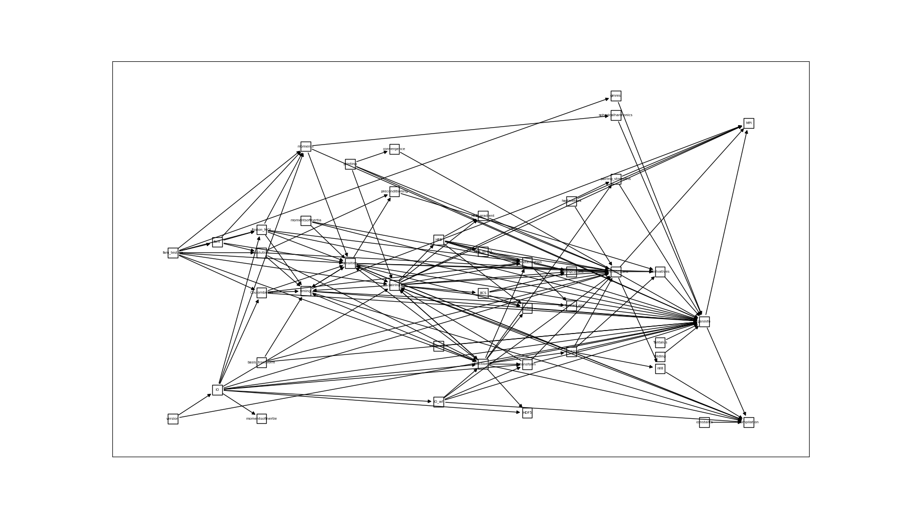

# Development of a Python based MOCCa

At the 4th MOCCa user meeting wouter presented an example script of how a MOCCaPy script could look like. That seems like a good starting point for a top-down approach.

## f90 code overview

### Observation

Modules contain a lot of data: that turns them more or less into classes. but since these data are not private they can be modified in every module that uses it. A good recipe for spaghetti code.

### Module structure

| .f90 file              | module             | use                                                                                 |
|------------------------|--------------------|-------------------------------------------------------------------------------------|
| basis_transform.f90    | basis_transform    | use geninfo                                                                         |
|                        |                    | use wavefunctions, only : HFblocks, nwt, spwf_map, nwt_local, hfblocks_global       |
|                        |                    | use timing                                                                          |
| BCS.f90                | BCS                | use vectors, only: PotentialVector                                                  |
|                        |                    | use wavefunctions                                                                   |
|                        |                    | use pairingcutoffs                                                                  |
| compilation.f90        | compilation        |                                                                                     |
| constants.f90          | constants          | use compilation                                                                     |
| convergence.f90        | convergence        | use Geninfo                                                                         |
| coulomb.f90            | Coulombmod         | use geninfo,          only: nx, ny, nz, dx, dp, stp                                 |
|                        |                    | use densities,        only: densityvector, potentialvector                          |
|                        |                    | use parameterization, only: dp, e2, pi, dv, coulorder, coultreatment                |
|                        |                    | use timing                                                                          |
| cranking.f90           | cranking           | use compilation                                                                     |
|                        |                    | use geninfo                                                                         |
|                        |                    | use derivatives                                                                     |
|                        |                    | use wavefunctions                                                                   |
|                        |                    | use nil8                                                                            |
|                        |                    | use pairing                                                                         |
|                        |                    | use densities                                                                       |
| densities.f90          | densities          | use compilation                                                                     |
|                        |                    | use geninfo                                                                         |
|                        |                    | use vectors                                                                         |
|                        |                    | use wavefunctions                                                                   |
|                        |                    | use pairing                                                                         |
|                        |                    | use derivatives                                                                     |
|                        |                    | use preconditioning                                                                 |
|                        |                    | use basis_transform                                                                 |
|                        |                    | use timing                                                                          |
| derivatives.f90        | derivatives        | use geninfo                                                                         |
| evolution.f90          | evolution          | use wavefunctions                                                                   |
|                        |                    | use functional                                                                      |
|                        |                    | use preconditioning                                                                 |
|                        |                    | use timing                                                                          |
| fam.f90                | fam                | use densities                                                                       |
|                        |                    | use moments                                                                         |
|                        |                    | use fission_MOI                                                                     |
|                        |                    | use evolution                                                                       |
| fam_gmres.f90          | gmres              | use geninfo, only : dp                                                              |
| fam_testing.f90        | fam_testing        | use densities                                                                       |
|                        |                    | use moments                                                                         |
|                        |                    | use Coulombmod, only : solve_coulomb                                                |
|                        |                    | use pairing,    only :  rho_can, pairingtype, rho_pairing, kappa_pairing            |
|                        |                    | use fission_MOI                                                                     |
|                        |                    | use functional                                                                      |
|                        |                    | use evolution                                                                       |
|                        |                    | use fam                                                                             |
|                        |                    | use gmres                                                                           |
| fission_MOI.f90        | fission_MOI        | use geninfo                                                                         |
|                        |                    | use densities                                                                       |
|                        |                    | use parameterization                                                                |
|                        |                    | use moments                                                                         |
|                        |                    | use timing                                                                          |
| folding.f90            | folding            | use geninfo                                                                         |
| functional.f90         | functional         | use compilation                                                                     |
|                        |                    | use geninfo                                                                         |
|                        |                    | use densities                                                                       |
|                        |                    | use parameterization                                                                |
|                        |                    | use pairing                                                                         |
|                        |                    | use transform                                                                       |
|                        |                    | use vectors                                                                         |
|                        |                    | use Cranking                                                                        |
|                        |                    | use pairing_strengths                                                               |
|                        |                    | use timing                                                                          |
|                        |                    | (use HDF5)                                                                          |
| geninfo.f90            | Geninfo            | use compilation , only : dp                                                         |
|                        |                    | (use MPI)                                                                           |
| hartree-fock.f90       | hartreefock        | use vectors, only: DensityVector, PotentialVector                                   |
|                        |                    | use wavefunctions                                                                   |
| hdf5_auxiliary.f90     | HDF5_auxiliary     | use HDF5                                                                            |
|                        |                    | use geninfo, dp, stp                                                                |
| HFB.f90                | HFB                | use geninfo                                                                         |
|                        |                    | use vectors, only: PotentialVector                                                  |
|                        |                    | use wavefunctions                                                                   |
|                        |                    | use pairingcutoffs                                                                  |
|                        |                    | use HFB_direct                                                                      |
|                        |                    | use HFB_gradient                                                                    |
| HFB_direct.f90         | HFB_direct         | use wavefunctions                                                                   |
|                        |                    | use parameterization                                                                |
| HFB_gradient.f90       | HFB_gradient       | use wavefunctions                                                                   |
| IO.f90                 | IO                 | use geninfo                                                                         |
|                        |                    | use wavefunctions                                                                   |
|                        |                    | use pairing                                                                         |
|                        |                    | use functional                                                                      |
|                        |                    | use momentsofinertia                                                                |
|                        |                    | use moments                                                                         |
|                        |                    | use Coulombmod                                                                      |
|                        |                    | use transform                                                                       |
|                        |                    | use fission_MOI                                                                     |
|                        |                    | use IO_wf, only: SYM_CODE, TRANS_CODE, allowtransform, extraspwfs                   |
|                        |                    | use IO_wf, only: version_number, file_version                                       |
|                        |                    | (use HDF5)                                                                          |
| IO_aux.f90             | IO_aux             |                                                                                     |
| IO_wf.f90              | IO_wf              | use compilation                                                                     |
|                        |                    | use GenInfo,       only: nx, ny, nz, dp, NPROCS, MPI_RANK, stp                      |
|                        |                    | use wavefunctions, only: HFBLOCKS                                                   |
|                        |                    | use functional,    only: ini_name_param, pairingtype, BCSGaps, HFBGaps, FermiEnergy |
|                        |                    | use transform,     only: sym_transfo_needed                                         |
| moments.f90            | moments            | use geninfo                                                                         |
|                        |                    | use sphericalharmonics                                                              |
|                        |                    | use Densities                                                                       |
| momentsofinertia.f90   | momentsofinertia   | use geninfo                                                                         |
|                        |                    | use densities                                                                       |
|                        |                    | use parameterization                                                                |
| nil8.f90               | nil8               | use compilation                                                                     |
| pairing.f90            | pairing            | use compilation                                                                     |
|                        |                    | use geninfo                                                                         |
|                        |                    | use wavefunctions                                                                   |
|                        |                    | use hartreefock                                                                     |
|                        |                    | use BCS                                                                             |
|                        |                    | use HFB                                                                             |
|                        |                    | use HFB_gradient                                                                    |
|                        |                    | use pairingcutoffs                                                                  |
|                        |                    | use parameterization                                                                |
|                        |                    | use pairing_strengths                                                               |
|                        |                    | use timing                                                                          |
|                        |                    | (use MPI)                                                                           |
| pairing_strengths.f90  | pairing_strengths  | use geninfo                                                                         |
|                        |                    | use parameterization                                                                |
| pairingcutoffs.f90     | pairingcutoffs     | use wavefunctions                                                                   |
| parameterization.f90   | parameterization   | use iso_fortran_env                                                                 |
|                        |                    | use pairingcutoffs                                                                  |
| precondition.f90       | preconditioning    | use derivatives                                                                     |
| printing.f90           | Printing           | use geninfo                                                                         |
|                        |                    | use pairing                                                                         |
|                        |                    | use wavefunctions                                                                   |
|                        |                    | use convergence                                                                     |
| scfiteration.f90       | SCFiteration       | use functional                                                                      |
|                        |                    | use densities                                                                       |
| sphericalharmonics.f90 | sphericalharmonics | use geninfo                                                                         |
| tantalus.f90           | Tantalus           | use geninfo                                                                         |
| timing.f90             | timing             | use compilation,     only : dp                                                      |
|                        |                    | use geninfo,         only : MPI_RANK, NPROCS, MPI_BLOCK_ASSIGNMENTS                 |
|                        |                    | use iso_fortran_env, only : int64, real64                                           |
|                        |                    | (use MPI           , only : MPI_COMM_WORLD, MPI_BARRIER)                            |
|                        |                    | use densities                                                                       |
| transform.f90          | transform          | use geninfo                                                                         |
|                        |                    | use wavefunctions                                                                   |
|                        |                    | use pairing                                                                         |
| vectors.f90            | vectors            | use geninfo                                                                         |
| version.f90            | version            | use GenInfo, only: SYMSTRING, MPI_RANK, NPROCS, reduX, reduY, reduZ                 |
|                        |                    | use IO,      only : SYM_CODE, TRANS_CODE                                            |
| wavefunctions.f90      | wavefunctions      | use derivatives                                                                     |
|                        |                    | use nil8                                                                            |
|                        |                    | (use MPI)                                                                           |

k wou een zicht krijgen hoe de modules in je code van elkaar afhangen. Dat bleek al snel een taak die manueel niet haalbaar was.
Dat gaf de graph hierboven (slecht leesbaar – ik geef het toe).
Er zijn twee modules aan de top: tantalus en fam_testing, en  aan de bodem: compilation, iso_fortran_env, mpi en hdf5. In totaal zijn er 206 links tussen 44 modules (3 modules zijn extern mpi, hdf5 en iso_fortran_env). Het totaal aantal paden tussen die 2 aan de top en de 4 onderaan is 171931 (!)
Hier is het histogram van de lengte van die paden

    2 1
    3 24
    4 220
    5 871
    6 2580
    7 5783
    8 10884
    9 17615
    10 24665
    11 29259
    12 28920
    13 23416
    14 15317
    15 7971
    16 3226
    17 969
    18 192
    19 18

Er zijn geen circular references.
 
de enige manier waarop ik dat kan interpreteren is dat alles van alles afhangt. Ik vind deze resultaten in hoge mate verwarrend.

ik doe de analyse opnieuw maar verwijder de links naar externe modules: mpi hdf5 en iso_fortran_env

Dat reduceert het aantal paden aanzienlijk, maar het is nog steeds groot: 56536
het histogram van de lengte van de paden is nu

    2 1
    3 11
    4 75
    5 285
    6 814
    7 1784
    8 3370
    9 5574
    10 8004
    11 9692
    12 9698
    13 7898
    14 5169
    15 2684
    16 1083
    17 324
    18 64
    19 6

ik vind dit qua structuur hoogst verwarrend.

## Conclusion 

It appears to me that reusing the fortran code will be nearly impossible due to the combination of data and subprograms in modules.

At this point the only thing I can imagine is to take the entire Tantalus module as is (perhaps augment it to allow accessing its internal data structures) into a python module and use that for validation purposes only, while at the same time redoing everything in python (where possible and efficient) or Fortran (if needed for performance reasons). 

## E-mail discussion with wouter

I sent the text above to Wouter which gave rise to the discussion below. 

#### Wouter 10/14/25 15:16

dat je MOCCa classificeert als spaghetti verbaast me niet; ik vind het nog steeds een boel ordelijker dan veel andere codes in ons domein, maar ik ben gebiasd :).

Dat "alles van alles afhangt" is inderdaad het centrale onderliggende probleem dat ik graag wil oplossen. Het is zeker dat er erg weinig van de code direct (= verpakken en klaar) bruikbaar is; ik heb wel de hoop dat er erg veel functionaliteit is die met een klein beetje herschrijfwerk mooi "functie-zonder-side-effects" kan worden gemaakt. 

Bvb. de Poisson solver in Coulomb.f90 is nu recent een stuk beter geworden in dat respect: de "solve_coulomb" subroutine refereert nog maar naar een miniem aantal globale variabelen (= de mesh parameters) en heeft geen effect op objecten die niet expliciet worden meegegeven.  Dat heeft me niet veel werk gekost, enkel wat meer expliciet geweest met inputs en systematische eliminatie van globale variabelen.

Dat zou mijn naïeve voorstel voor een strategie zijn: 

stukken Fortran met complexe code herbruiken waar nodig maar die loskoppelen van globale variabelen en de function/subroutine signatures veel explicieter maken. Ik wil daar gerust mee helpen; als we beslissen om X functionaliteit om te zetten naar een mooie functie zonder side-effects met een op voorhand besliste signatuur, dan kan i dat relatief snel gedaan krijgen denk ik zo.

stukken Fortran die aan administratie doen of basic berekeningen die makkelijk te coderen en snel uitvoerbaar zijn te vervangen door Python.

Zodus, eigenlijk "ja" op je "Conclusion" met de caveat dat ik Fortran ook zoveel mogelijk zou hergebruiken als de code complex is, ook als ze misschien niet performance-critical is. Een voorbeeld is de functie "CompCOMcorrection" in functional.f90; dat stuk code heeft me jaren van mijn leven gekost maar is niet duur in CPU cycles (indien correct gebruikt!); het lijkt me beter om dat te verfraaien in Fortran en dan te verpakken om fouten te vermijden die zeker gaan opkomen in een Python vertaling.

Groeten, 

Wouter

P.S. Trouwens, is het minimaliseren van paden en hun lengte echt een goed objectief? Als ik bijvoorbeeld de precisie definieer in compilation.f90, dan heb ik die toch overal nodig en krijg ik toch automatisch lange paden? Ik vermoed ook dat je telling wel wat dingen dubbel telt omdat mijn Fortran "use" wat te overvloedig zijn: densities.f90 heeft bijvoorbeeld een "use compilation; use geninfo" maar omdate "geninfo.f90" een "use compilation" heeft is de eerste use in densities.f90 eigenlijk overbodig.

#### Bert 10/14/25 16:33

    dat je MOCCa classificeert als spaghetti verbaast me niet; ik vind het nog steeds een boel ordelijker dan veel andere codes in ons domein, maar ik ben gebiasd :).

Toe ik een eeuwigheid geleden doctoreerde, las ik in physics today – denk ik – altijd de rubriek over programmeren. Ik herinner me dat toen al iemand de voordelen zag van een toepassing scriptable maken (python moest nog uitgevonden worden), maar dat die ook kloeg over het gebrek aan inzicht in software engineering.

    Dat "alles van alles afhangt" is inderdaad het centrale onderliggende probleem dat ik graag wil oplossen. Het is zeker dat er erg weinig van de code direct (= verpakken en klaar) bruikbaar is; ik heb wel de hoop dat er erg veel functionaliteit is die met een klein beetje herschrijfwerk mooi "functie-zonder-side-effects" kan worden gemaakt. 

2x akkoord

    Dat zou mijn naïeve voorstel voor een strategie zijn: 
    
    stukken Fortran met complexe code herbruiken waar nodig maar die loskoppelen van globale variabelen en de function/subroutine signatures veel explicieter maken. Ik wil daar gerust mee helpen; als we beslissen om X functionaliteit om te zetten naar een mooie functie zonder side-effects met een op voorhand besliste signatuur, dan kan ik dat relatief snel gedaan krijgen denk ik zo.

ok, tegelijk wil ik wat nu is ook als blob exposen in python – ongewijzigd, maar met toevoegingen die het mogelijk maken die globale variabelen te lezen en te schrijven. Op die manier kunnen we de nieuwe dingen testen.

    stukken Fortran die aan administratie doen of basic berekeningen die makkelijk te coderen en snel uitvoerbaar zijn te vervangen door Python.

prima
 
    Zodus, eigenlijk "ja" op je "Conclusion" met de caveat dat ik Fortran ook zoveel mogelijk zou hergebruiken als de code complex is, ook als ze misschien niet performance-critical is. Een voorbeeld is de functie "CompCOMcorrection" in functional.f90; dat stuk code heeft me jaren van mijn leven gekost maar is niet duur in CPU cycles (indien correct gebruikt!); het lijkt me beter om dat te verfraaien in Fortran en dan te verpakken om fouten te vermijden die zeker gaan opkomen in een Python vertaling.

Dat klopt.

    P.S. Trouwens, is het minimaliseren van paden en hun lengte echt een goed objectief? Als ik bijvoorbeeld de precisie definieer in compilation.f90, dan heb ik die toch overal nodig en krijg ik toch automatisch lange paden? Ik vermoed ook dat je telling wel wat dingen dubbel telt omdat mijn Fortran "use" wat te overvloedig zijn: densities.f90 heeft bijvoorbeeld een "use compilation; use geninfo" maar omdate "geninfo.f90" een "use compilation" heeft is de eerste use in densities.f90 eigenlijk overbodig.

Nee, dat is zeker geen objectief op zich, maar het verraste me erg (zo erg dat ik dat bijna met 1 r zou schrijven 😊). De projecten die ik ken hebben veel meer een omgekeerde boomstructuur. Iets dat vertakt naar beneden toe, eerder dan iets dat zich in alle richtingen kris kras verspreid. Mogelijk leent Python zich daar meer toe.

#### Bert 15/10 13:11

Is CONFIG=BXL dan de beste optie om mee aan de slag te gaan?

#### Wouter 15/10 13:23

Ja; redelijk weinig verschil met NLO en beide zijn de meest "basis" configs.

#### Bert 15/10 13:49
    
    (Wouter) Dat zou mijn naïeve voorstel voor een strategie zijn: 
    - stukken Fortran met complexe code herbruiken waar nodig maar die loskoppelen van globale 
    variabelen en de function/subroutine signatures veel explicieter maken. Ik wil daar gerust mee
    helpen; als we beslissen om X functionaliteit om te zetten naar een mooie functie zonder
    side-effects met een op voorhand besliste signatuur, dan kan ik dat relatief snel gedaan krijgen
    denk ik zo.
    - stukken Fortran die aan administratie doen of basic berekeningen die makkelijk te coderen en 
    snel uitvoerbaar zijn te vervangen door Python.

Ik ben dit idee wel genegen. Dat kan echter op verschillende manieren.

1. De Fortran code die we willen gebruiken wordt gecopieerd van `src` (!) naar een nieuwe plaats ergens in de `MOCCaPy` directory en aangepast zodat hij ontkoppeld wordt van de globale variabelen.
    - Voordelen: 
      - De “nieuwe” code is goed leesbaar en geisoleerd, daardoor goed te structureren
    - Nadelen:
      - De code is losgekoppeld van `Hephaestos`
      - De code is losgekoppeld van src_orig, aanpassing in `src_orig` moeten mogelijk ook gebeuren in de kopie. Dat kan leiden tot bugs, divergentie van beide codes, niet gepercipieerde verschillen tussen beide codes en moeilijkheden bij validatie van de nieuwe code in MOCCaPy ten opzichte  van de full fortran versie.
 
2. Het loskoppelen van de globale variabelen gebeurt in `src_orig` met behulp van preprocessor directives zodat ze zowel bruikbaar is met de globale variabelen als erzonder (afhankelijk van iets als #define DO_NOT_USE_GLOBALS of zoiets)
   - Voordelen
     - De code is niet losgekoppeld van `Hephaestos`
     - De code is niet losgekoppeld van src_orig
   - Nadelen
     - De code is moeilijker leesbaar
     - De “nieuwe” code is niet geisoleerd, de oorspronkelijke file structuur blijft behouden
         
3. Tussenoplossing: de subprograms die losgekoppeld moeten worden van de globale variabelen worden uit hun oorspronkelijke file in src_orig gelicht en in een aparte file geplaatst en daar aangepast met preprocessor directives. Deze file wordt ge-include-d in de oorspronkelijke src_orig.
   - Voordelen
     - Geisoleerde code
     - Niet ontkoppeld van `Hephaestos` en `src_orig`
   - Nadelen
     - leesbaarheid vermindert door preprocessor directives
     - `Hephaestos` moet draaien op src_orig maar NA het includen van de uitgelichte stukken. (m.i. een beperkte aanpassing)
      - Dat zou wel eens tot veel bestanden kunnen leiden waarin het overzicht zoek kan geraken. Dat vraagt zeker de nodige aandacht.
 
#### Bert 15/10 13:49

Bij nader inzien denk ik dat 1. de snelste vooruitgang toelaat, op voorwaarde dat binnen de MOCCaPy branch src_orig EN src bevroren blijven.  Mijn voornaamste argurment daarvoor is dat we zo het meeste vrijheid bij het herstructureren hebben. Bij een volgende iteratie kan er naar betere integratie met `Hephaestos` en src_orig gezocht worden.

(Maar denk vooral ook zelf na hierover, het is niet mijn bedoeling u in een richting te duwen die ge niet zelf wilt.)

#### Wouter 15/10 20:35

**Over de strategiën**

ik denk dat strategie 2  (#DO_NOT_USE_GLOBALS) géén goede optie is; ik geloof dat we dan in praktijk gewoon twee versies van alle routines gaan schrijven, een boel extra werk en veel kansen op fouten.
strategie 3 ("tussenoplossing") verwerp ik minder snel dan 2, maar ik vrees dat we dan te veel blijven vasthangen aan de huidige structuur van `Hephaestos` - en dus ook aan de vergissingen die gemaakt zijn.
nummer 1 ("frozen src") lijkt me voor het moment optimaal. Zoveel mogelijk structuur inbouwen in de basis leidt misschien ook tot extra structuur in hetgene dat `Hephaestos` gaat vervangen.
Los van de development strategie an sich,  denk ik ook dat een boel te leren heb van je op software-organisatie vlak. Het is misschien goed dat dat gebeurd op basis van een solide Fortran + Python basis - dat is voor ons beiden het meest recht-door-zee en speelt (denk ik) het best in op je sterke punten.

Het nadeel van optie 1 - dat de flexibiliteit van `Hephaestos` pas later komt - hoeft ook niet meteen een groot minpunt te zijn want ons eerste doel zijn relatief simpele berekeningen voor kernen. Zelfs als we binnen de tijdsspanne van dit project niet verder komen dan een Fortran+python basis, dan nóg zijn er een heleboel interessante projecten waar deze effort ons mee zou helpen op korte termijn.

Over doelen gesproken, lijkt het niet nuttig dat we een duidelijk "eerste streef berekening" als doel afbakenen? Zo'n Ca40 bvb. Dat zou ons werk wel kunnen focussen, bvb doordat ik zou kunnen aanduiden welk deel van de code nodig is en welk deel niet om die berekening te doen.

**Over testen - referentieversies**

Ik heb relatief weinig problemen met het bevriezen van src/ en src_orig op je branch; dat zou al veel problemen moeten voorkomen. Ik vraag me wel af of het het werk waard is om MOCCa als "blob" te verpakken om tests in Python te kunnen doen; zijn wat bash scripts niet voldoende? Er zijn er al een aantal in testing/integration

In elk geval is unit testing iets dat ik absoluut wil meenemen in deze rewrite; nu het aantal users geexplodeerd is en ik ook het aantal developers wil uitbreiden heb ik gerealiseerd dat unit tests (en integration tests, maar die zijn makkelijker) de enige manier zijn om een redelijk vertrouwen in de codebase te behouden op langere termijn. Een goede unit test schrijven is nu een gigantische onderneming voor de huidige staat van de code omdat alles van elkaar afhangt. Ik weet dat je waarschijnlijk op deze manier werkt en dat alles loskoppelen unit tests zeker gaan vermakkelijken, maar ik wou het maar even onderlijnen.

#### Bert 15/16 23:06

De bedoeling van strategie 2 is juist dat er geen 2 versies zijn van elke routine, maar dat met behulp van de preprocessor een routine kan gebruikt worden met en zonder globals. Dat is wat gedoe, en iets minder leesbaar maar kan wel werken. Nu ik daarover nadenk is er een variant daarop mogelijk: je past de subroutine aan zodat ze geen globals meer gebruikt maar de datastructuren als argument doorgeeft. Tegelijk behoudt je ook de subroutine met de oorspronkelijke signature, maar je vervangt zijn hele body met een call naar de nieuwe subroutine met de globals als argument. Met function overloading kunnen beide subroutines zelfs dezelfde naam hebben denk ik en qua performance is dat zeker ook geen probleem. Op die manier behoudt je de executable en heb je tegelijk ook subroutines die je in een python module kan stoppen.

#### 16/10 10:23

    nummer 1 ("frozen src") lijkt me voor het moment optimaal. Zoveel mogelijk structuur inbouwen in de
    basis leidt misschien ook tot extra structuur in hetgene dat Hephaestos gaat vervangen.
 
Dat klopt waarschijnlijk wel. Het is de properste en makkelijkste aanpak. Het leidt wel tot een harde breuk tussen de huidige versie en de nieuwe. Als de nieuwe versie klaar is, is het misschien helemaal niet meer duidelijk wat de band met oorspronkelijke code was. Dat kan later het overzetten van andere stukken uit huidige code bemoeilijken. Misschien moeten we tijdens dit proces de huidige code (in src_orig!) annoteren om aan te geven wat naar waar overgezet is. (dat is lastig en error-prone). De nieuwe code annoteren met van waar ze komt, is ook een optie en makkelijker. Dat lijkt misschien een triviaal probleem maar herstructureren leidt ook tot nieuwe namen waardoor verbanden met de huidige code vertroebeld worden.
 

## On `Hephaestos`

#### Bert 15/10 12:39

Ik denk ook nog na over `Hephaestos`. Er zijn twee opties:

- Ik negeer `Hephaestos` en ga aan de slag met de code in src (BXL). We bekijken achteraf hoe `Hephaestos` kan inwerken op het resultaat. Complexiteit wordt gespreid, maar is misschien lastig in te passen achteraf. Naar verwachting is de code op dat moment dan wel beter gestructureerd en zijn verantwoordelijkheden geisoleerd.
- We nemen `Hephaestos` mee van in het begin. Alle complexiteit is van in het begin te behandelen. Geen garantie dat dat een beter resultaat geeft. mogelijk is mijn brein daar te klein voor,

#### Wouter 15/10 12:55

het is - denk ik - belangrijk om rekening te houden met de volgende feiten:

  * de Tantalus fortran source code "robuust" is, in de zin dat die code
    eigenlijk al versie 3 is (v1 = code van mijn promotor, eerst
    geschreven in 89 ofzo; v2 = mijn doctoraatscode) en dat die dus al
    het product van veel ervaring is. Los daarvan zijn er wereldwijd een
    aantal codes die dezelfde vergelijkingen oplossen (wel niet met
    dezelfde generaliteit etc...); en ik heb die papers gelezen.
  * `Hephaestos` is nog steeds heel erg experimenteel: er bestaat niets
    gelijkaardigs in de wereld en ook ik heb nog niet veel op het
    concept geïtereerd. Het échte probleem is dat niemand behalve ik van
    alles op de hoogte is.

Als we dat in rekening brengen, dan denk ik we voor optie 1 moeten gaan.
We schuiven dan inderdaad complexiteit op de lange baan, maar ik denk
niet dat ik vandaag in staat ben om een "optimaal" design voor
`Hephaestos` te maken. Als we de basisfunctionaliteit van de FORTRAN al
eens opkuisen zullen we hopelijk al doende veel opklaren voor
`Hephaestos`. Optie 1 impliceert dat we een "evolutiekost" zullen moeten
betalen, maar ik denk dat dat eigenlijk onvermijdelijk is - een perfect
design maken kan alleen met veel ervaring in zaken, en die ervaring is
simpelweg nog niet groot genoeg voor `Hephaestos`. Dat zal voor MOCCav5
moeten zijn....

Sowieso lijkt het mij te ambitieus om écht alle functionaliteit te
bewaren op de loop van dit project; met een kern-executable ( = geen
pasta, geen FAM, ... ) kunnen Emilien en ik al heel wat.

#### Bert 15/10 12:55

Is in src files zichtbaar welke secties door `Hephaestos` geschreven/aangepast zijn?

#### Wouter 15/10 12:55

Dat is helaas niet super-expliciet; alle "$"-signs in src_orig worden
aangepast, maar er is geen lijn-bij-lijn aanpassing. De src-files
bewaren wel een kopietje van wat is aangepast geweest in de comments in
de header, daar vind je welke variabele is vervangen door wat.

Als dat belangrijk is voor je, dan valt daar wel relatief makkelijk een
mouw aan te passen; ik laat `Hephaestos` gewoon een comment invoegen
telkens hij iets wegschrijft.

#### Bert 15/10 13:11

Dat zou wel nuttig zijn, denk ik.

#### Wouter 15/10 13:24

Ok, ik probeer dat snel ineen te boksen.

#### Wouter 15/10 20:35

**Over het Hephaestos-annoteren**

Ik heb net een merge op de master branch gedaan die Hephaestos systematisch laat annoteren met

    !Hephaestos>>>
    <CODE BLOCK>
    !Hephaestos<<<

voor multilijn dingen; en

    <CODE> ! Hephaestos substitution

voor single-lijn dingen; en

    #if <CODE> /* Hephaestos */

voor preprocessor lijnen. Moest je niet akkoord zijn met dit annotatie-format, je kan het makkelijk veranderen in src_heph/heph_substitute.py.

Je kan master naar MOCCaPy mergen zonder problemen geloof ik; zeg me als je liever hebt dat ik dat doe.

Nota: ik format de code om er goed uit te zien VOOR `Hephaestos`; dwz dat na `Hephaestos` er niet alles mooi uitziet, en zeker de nieuwe annotaties niet.

#### Bert 16/10 11:05

    Je kan master naar MOCCaPy mergen zonder problemen geloof ik; 
    zeg me als je liever hebt dat ik dat doe.

Dat zou handig zijn: ik krijg een merge conflict op src_orig/evolution.f90 en ik zie niet wat er mis is …

### Conclusion of the discussion above

- We gaan voor een aanpak waarbij te recupereren code gekopieerd wordt naar een directory-structuur onder `MOCCaPy/` zodat we evolueren naar een **optimale structuur** van het project.
- We gaan uit van `src` gebouwd met `CONFIG=BXL` en bevriezen die `src`. We nemen die `src` ook mee in branch MOCCaPy.
- We geven de koppeling met `Hephaestos` en met `src_orig` op (ten voordele van een nieuwe - betere - projectstructuur). We proberen wel bij te houden in de repo welke code gerecupereerd wordt, zodat later bij het porteren van onderdelen die we nu niet nodig hebben duidelijk is wat er al ge-port is en wat niet.
- De master branch wordt nog één keer gemerged met de MOCCaPy branch om de Hephaestos annotatie te incorporeren. Daarna niet meer! Anders verliezen we de link vanwaar de MOCCaPy afstamt.
- 