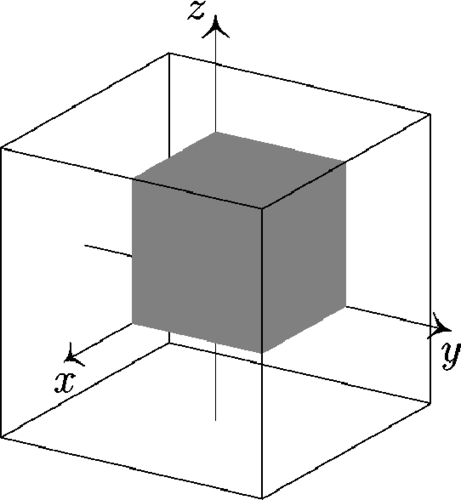
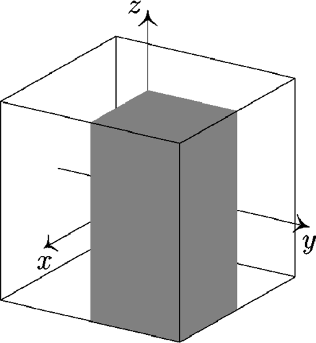

# Breaking symmetries: practical aspects

Any given MOCCa executable comes with a *predefined* set of self-consistent symmetries that are enforced and thus exploited for numerical and interpretational gain. These self-consistent symmetries are determined at *compile-time* through the choice of the configuration, see the documentation [here](config.md). 

Today, the predefined configuration files offer four different sets of conserved symmetries, each (i) fully determined by the generators of the conserved symmetry group, (ii) a colloquial reference, (iii) the suffix of the configuration file, i.e. the `-T` in `NLO-T.py` and (iv) a representation of the Cartesian axes as determined by the `REDUCE` variable in the configuration file. 

The four options are:

Conserved symmetries | Colloquial reference | Suffix | `Reduce` | 
    ----------------------|----------------------|--------------------------|----|
\( R_z, T, S^T_y, P \) |    maximally symmetric | NA | `[1,1,1]`
\( R_z, T , S^T_y \)   |   broken parity" |  `-P` |  `[1,1,0]`
\( R_z, P , S^T_y \)  |   broken time-reversal | `-T`  |  `[1,1,1]`
\( R_z,  S^T_y \)      |   broken P and T | `-TP` |  `[1,1,0]`

Everything with conserved $P$ represents only one octant of the simulation volume as in the figure on the left. Configurations with broken parity represent the full z-axis, as in the figure on the right.

{ width='300' }
{ width='300' }

!!! Note 
    Of course, this means that the computational requirements rise dramatically as symmetries get broken. Memory requirements always grow (roughly) with a factor of two for every broken symmetry. The CPU time does so too when dealing with finite nuclei, though you might see non-linear effects if the increase in memory results in extra cache misses. For calculations with large `nwn` and `nwp` however, the scaling might change more dramatically as the dominating cost becomes orthonormalisation of single-particle wavefunctions.

!!! Warning Symmetries not enforced does not symmetries broken 
    Not *enforcing* a given symmetry does *not* imply that the mean-field solution will break it! For example, running an executable compiled with a `-P` configuration file can still easily result in mean-field configurations that are reflection symmetric. You will also need some way to explicitly break a symmetry at the start of the iterations; the easiest way (for spatial symmetries) is to specify a constraint on some symmetry-breaking multipole moment.


## Starting a calculation from scratch 

Except for the `-TP` symmetry set, all options above can start from scratch: by specifying `inputfilename="init"'` and `AllowTransform = .true.'` in the `&IO/` namelist and, the executable will be able to start iterating starting from an initial guess generated from a simple Nilsson Hamiltonian. Note that this initial guess will in general NOT break any symmetry. 
 

## Warmstarting from more symmetric calculations

A far more efficient way to do to symmetry-broken calculations is by reusing wavefunction files from calculations with **more imposed symmetries**. To do so, you should 

1. Set `inputfilename` to the wavefunction file (`.wf`) from the more symmetric calculation
2. Add `AllowTransform = .true.` to the `&IO/` namelist
3. Adapt the number of mesh points and number of wavefunctions to the new calculation. 
4. Run the calculation with an executable whose (i) symmetries match your application and (ii) whose *input symmetries* match those of the input wavefunction file.

Note that step 3 requires you to understand what you are doing: 
- When moving from a symmetry set that reduces a given axis $\mu$, the corresponding number of mesh points needs to be doubled. For example: when breaking parity, the symmetry-broken calculation should specify `nz` as double the value of the symmetry-conserving calculation.
- When breaking time-reversal symmetry, `nwn` and `nwp` need to be doubled w.r.t. the symmetry-conserving calculation. 


??? Note "Understanding the transformation of `nx`, `ny` and `nz` "
    The number of mesh points specified in MOCCa's input file always corresponds to the number that are actually represented in the computers memory. I.e. specifying $nx=ny=nz=5$ for the maximally symmetric mode means that MOCCa will store quantities such as the density on a $5\times 5 \times 5$ grid, but what we are simulating is a (symmetric) nuclear configuration on a grid $10 \times 10 \times 10$ mesh points!

??? Note "Understanding the transformation of `nwn` and `nwp` "
    The parameters `nwn` and `nwp` specify the number of wavefunctions in *memory*, not the physical number of states that is simulated. If time-reversal is conserved, the full nuclear configuration is specified in terms of $(2 \times$ `nwn`, 2$\times$ `nwp`) wavefunctions. 


The code will always output information about the transformation performed in the header. Look for output like:

```
___________________________________________________________
| Transformation of the input                              |
| On file:                                                 |
|    nx, ny, nz    =    12   12   24                       |
|    dx            =  0.8000000 (fm)                       |
|    nwn, nwp      =      20     20                        |
|    (n+,n-)       = (   20    0    0    0)                |
|    (p+,p-)       = (   20    0    0    0)                |
| This calculation:                                        |
|    nx, ny, nz    =    12   12   28                       |
|    dx            =  0.8000000 (fm)                       |
|    nwn, nwp      =      20     20                        |
|    (n+,n-)       = (   20    0    0    0)                |
|    (p+,p-)       = (   20    0    0    0)                |
|__________________________________________________________|
```

Symmetry breaking is unfortunately complicated, and several important caveats apply. 

1. The code is only capable of *breaking one symmetry* in any given run. It is impossible to transfer from maximally symmetri directly to `-PT` in one go. 
2. The code is incapable of combining *symmetry breaking* with modifying mesh parameters and adding single-particle wavefunctions in a single run. If you want to add mesh points, do so in a separate run.
3. It is impossible to restore symmetries, i.e. you cannot use a wavefunction generated by a `-P` executable to warmstart a maximally symmetric calculation.
4. The flag `AllowTransform` exists to protect you; if you set it to on, you are disabling many sanity checks and it becomes very easy to make mistakes. ***Do not set it to .true. by default.***
5. Not all symmetry-breaking transformations are available; in practice you cannot go from a `-T` wavefunction to a `-PT` calculation. Instead, go through the `-P` executable, as illustrated by the following diagram.


```
                                   Maximally symmetric mode
                                             |
                   |----------<<<<<----------|---------->>>>>>----------|
                   v                                                    v
                   |                                                    |
              Time-reversal broken                               Parity broken 
                   |                                                    |
                   v                                                    v
                   |                                                    |
                   ------ [TRANSFORMATION NOT IMPLEMENTED] ----    P & T broken      
```
