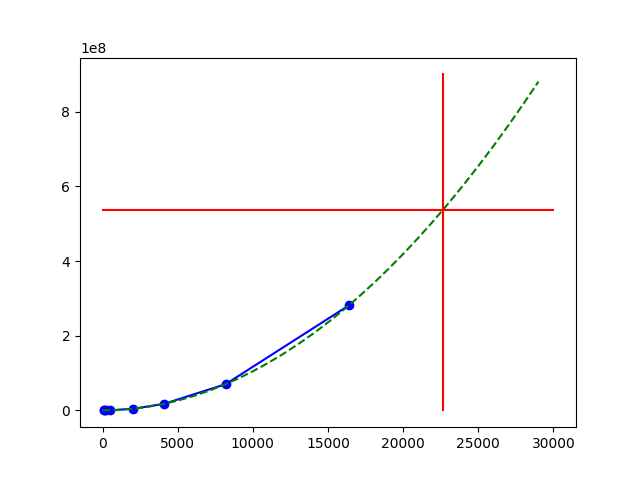

# Scaling tests

We solve a rather small problem sequentially and distributed with different blocking factors.
The matrix is represented fully on rank 0 and distributed over all ranks. 
we restrict to a single node 2x2, 4x4 and 8x8 processor grids

a Vaughan node has 256 GB RAM, for 64 cores, that is 4 GB per core. 
1 GB is `1073741824` bytes, so 1 core can accomodate `4 * 1 073 741 824 / 8 = 536 870 912` doubles.

This means a vaughan can rougly accommodate a 20000x20000 system on 1 node. Obviously this deteriorates as in the current approach rank 0 must store the entire matrix. In the pasta model it in fact stores the matrix twice (1D and 2D format)



```
already run           +  +  +   +   +   +   +   +                                      +                                       +                                         +
nprow                [1, 2, 3,  4,  5,  6,  7,  8,  9,  10,  11,  12,  13,  14,  15,  16,  17,  18,  19,  20,  21,  22,  23,  24,  25,  26,  27,  28,  29,  30,  31,   32]
nprow^2              [1, 4, 9, 16, 25, 36, 49, 64, 81, 100, 121, 144, 169, 196, 225, 256, 289, 324, 361, 400, 441, 484, 529, 576, 625, 676, 729, 784, 841, 900, 961, 1024]
math.ceil(nprow^2/64)[1, 1, 1,  1,  1,  1,  1,  1,  2,   2,   2,   3,   3,   4,   4,   4,   5,   6,   6,   7,   7,   8,   9,   9,  10,  11,  12,  13,  14,  15,  16,   16]
ranks on last node.  [1, 4, 9, 16, 25, 36, 49,  0, 17,  36,  57,  16,  41,   4,  33,   0,  33,   4,  41,  16,  57,  36,  17,   0,  49,  36,  25,  16,   9,   4,   1,    0]
```
the one but last row is the numbe of nodes needed for nprow x nprow process grid.
the last row is the number of cores used by the last node that is not fully used, I suspect that for multinode runs where the last node has only a few cores in use will have bad timings.
Ideally its value is 0, i.e. 8x8 (1 node, 64 processes), 16x16 (4 nodes, 256 processes), 24x24 (9 nodes, 576 processes) 32x32 (16 nodes, 1024 processes), the next case is 200x200 (25 nodes)

these timings were considered as outlier >10 times larger than the average value so far. 

    outlier excluded (144, 392867.2622017339)   16
    outlier excluded (676,1483697.6581768815)   36
    outlier excluded (729, 771320.9982358862)   25
    outlier excluded (841,1604522.540233226)     9
    outlier excluded (225, 356188.2852682009)   33
    outlier excluded (324, 638357.8269644168)    4
    outlier excluded (484, 810941.0065977469)   36
    outlier excluded (676,3585587.3128699297)   36
    outlier excluded (784,3196718.199785521)    16
    outlier excluded (900,3341902.356089056)     4
    outlier excluded (961,2151078.8390254164)    1