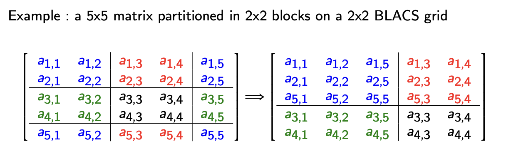

[scalapack tutorial from gwdg](https://info.gwdg.de/wiki/doku.php?id=wiki:hpc:scalapack)


no details given

BUT FINALLY IT WORKS! 

``` shell
> ./cl.sh 
mpiifx -o exe src.f90 -lmkl_blacs_intelmpi_lp64 -lmkl_scalapack_lp64 -lmkl_intel_lp64 -lmkl_sequential -lmkl_core

[0/4] myrow=0 mycol=0 nprow=2 npcol=2
[1/4] myrow=1 mycol=0 nprow=2 npcol=2
[2/4] myrow=0 mycol=1 nprow=2 npcol=2
[3/4] myrow=1 mycol=1 nprow=2 npcol=2

rank[0(0,0)/4] A_sub: 3x4 (allocated)
rank[1(1,0)/4] A_sub: 2x4 (allocated)
rank[2(0,1)/4] A_sub: 3x3 (allocated)
rank[3(1,1)/4] A_sub: 2x3 (allocated)

11. 12. 13. 14. 15. 16. 17.
21. 22. 23. 24. 25. 26. 27.
31. 32. 33. 34. 35. 36. 37.
32. 42. 43. 44. 45. 46. 47.
33. 52. 53. 54. 55. 56. 57.

[0/4]=(0,0) A_sub:         | [2/4]=(0,1) A_sub:
   11.   12.   15.   16.   |    13.   14.   17.
   21.   22.   25.   26.   |    23.   24.   27.
   51.   52.   55.   56.   |    53.   54.   57.
 
[1/4]=(1,0) A_sub:         | [3/4]=(1,1) A_sub:
   31.   32.   35.   36.   |    33.   34.   37.
   41.   42.   45.   46.   |    43.   44.   47.

[2/4]=(0,1) A_sub:
   13.   14.   17.
   23.   24.   27.
   53.   54.   57.

[3/4]=(1,1) A_sub:
   33.   34.   37.
   43.   44.   47.
```

(The output was edited a bit for clarity)